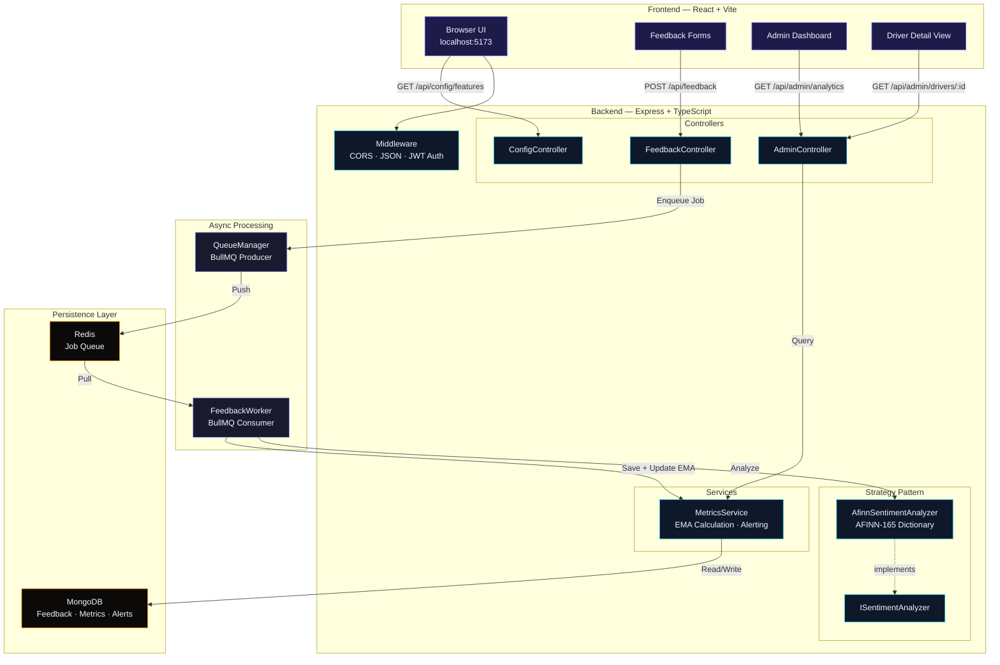
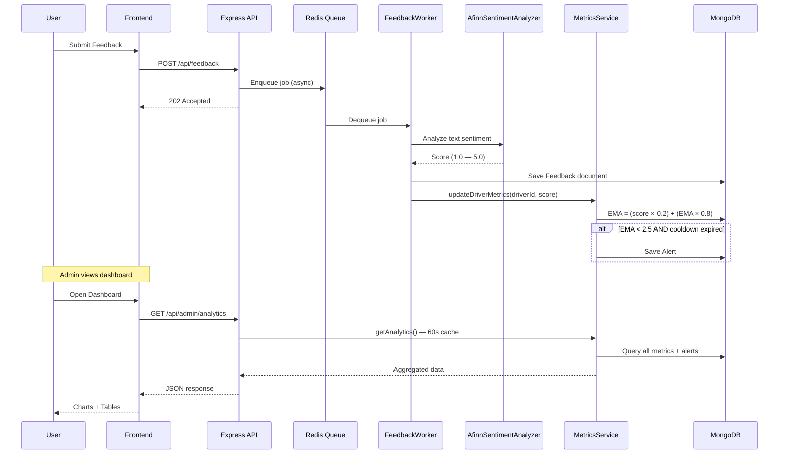

# Driver Sentiment Engine

  

A production-grade, full-stack system for real-time driver feedback ingestion, sentiment analysis, and performance monitoring — built with OOP principles, asynchronous processing, and O(1) metric updates.

  

---

  

## Architecture

  



  

### Data Flow

  



  

---

  

## Tech Stack

  

| Layer | Technology |

|---|---|

| **Frontend** | React 19, Vite, TypeScript, TailwindCSS, Recharts, Lucide Icons |

| **Backend** | Node.js, Express v5, TypeScript |

| **Queue** | BullMQ + Redis |

| **Database** | MongoDB + Mongoose |

| **Auth** | JWT (mock admin login) |

  

---

  

## Project Structure

  

```

MoveInSync/

├── backend/

│ └── src/

│ ├── config/ # Database singleton

│ ├── controllers/ # FeedbackController, AdminController, ConfigController

│ ├── interfaces/ # TypeScript interfaces

│ ├── middleware/ # JWT auth middleware

│ ├── models/ # Mongoose schemas (Feedback, DriverMetrics, Alert)

│ ├── queue/ # QueueManager (producer) + FeedbackWorker (consumer)

│ ├── routes/ # Express route definitions

│ ├── services/ # MetricsService (EMA + alerting)

│ ├── strategies/ # ISentimentAnalyzer + AfinnSentimentAnalyzer

│ └── index.ts # App bootstrap

│

├── frontend/

│ └── src/

│ ├── components/ # Navbar, FeedbackForm

│ ├── pages/ # Home, AdminLogin, AdminDashboard, DriverDetail

│ ├── services/ # Axios API client with JWT interceptor

│ ├── store/ # React Context (auth + feature flags)

│ ├── App.tsx # Router setup

│ └── main.tsx # Entry point

│

└── README.md

```

  

---

  

## Design Patterns

  

| Pattern | Where | Why |

|---|---|---|

| **Singleton** | `Database`, `QueueManager` | Single connection instance across the app |

| **Strategy** | `ISentimentAnalyzer` → `AfinnSentimentAnalyzer` | Swap analysis algorithms without changing consumers |

| **Dependency Injection** | `FeedbackWorker` receives analyzer + metrics service | Testable, loosely coupled components |

| **Controller–Service** | Controllers delegate to `MetricsService` | Separation of HTTP handling from business logic |

| **Observer** | BullMQ worker listens for queue events | Decoupled async processing |

  

---

  

## Key Algorithms

  

### Exponential Moving Average (EMA) — O(1)

  

```

EMA_new = (Score × α) + (EMA_current × (1 − α))

```

  

-  **α = 0.2** — recent scores get 20% weight

-  **O(1) time & space** — only stores current EMA + count per driver

- No need to re-scan historical data

  

### Sentiment Analysis (AFINN-165)

  

- Tokenizes text → lowercased words

- Looks up each word in a 2,477-word dictionary (scored −5 to +5)

- Averages matched scores → normalizes to **1.0 – 5.0** range

- Returns **3.0** (neutral) if no sentiment words found

  

### Alert Throttling

  

- Fires when **EMA drops below 2.5**

-  **1-hour cooldown** between alerts per driver

- Prevents alert fatigue from rapid feedback submissions

  

---

  

## API Endpoints

  

| Method | Endpoint | Auth | Description |

|---|---|---|---|

| `POST` | `/api/feedback` | — | Submit driver feedback (returns 202) |

| `GET` | `/api/config/features` | — | Feature flags for feedback forms |

| `POST` | `/api/admin/login` | — | Admin JWT login |

| `GET` | `/api/admin/analytics` | JWT | All drivers: metrics + alerts |

| `GET` | `/api/admin/drivers/:id` | JWT | Individual driver detail |

| `GET` | `/api/health` | — | Health check |

  

---

  

## Getting Started

  

### Prerequisites

  

-  **Node.js** ≥ 18

-  **MongoDB** (local or Atlas)

-  **Redis** (local)

  

```bash

# macOS — install via Homebrew

brew  install  mongodb-community  redis

```

  

### 1. Start Services

  

```bash

brew  services  start  mongodb-community

brew  services  start  redis

```

  

### 2. Backend

  

```bash

cd  backend

npm  install

cp  .env.example  .env  # or use defaults below

npm  run  dev

```

  

The server starts on **http://localhost:5001**.

  

### 3. Frontend

  

```bash

cd  frontend

npm  install

npm  run  dev

```

  

Open **http://localhost:5173** in your browser.

  

---

  

## Environment Variables

  

| Variable | Default | Description |

|---|---|---|

| `PORT` | `5001` | Backend server port |

| `MONGODB_URI` | `mongodb://localhost:27017/driver-sentiment` | MongoDB connection string |

| `REDIS_HOST` | `localhost` | Redis host |

| `REDIS_PORT` | `6379` | Redis port |

| `JWT_SECRET` | `moveinsync_secret_key_2024` | JWT signing secret |

| `EMA_ALPHA` | `0.2` | EMA smoothing factor (0–1) |

| `ALERT_THRESHOLD` | `2.5` | EMA score below which alerts fire |

| `ALERT_COOLDOWN_MS` | `3600000` | Minimum ms between alerts per driver |

  

---

  

## Usage

  

### Submit Feedback

  

```bash

curl  -X  POST  http://localhost:5001/api/feedback  \

-H "Content-Type: application/json" \

-d  '{"driverId":"D001","feedbackType":"driver","text":"Excellent and safe driving!","rating":5}'

```

  

### Admin Login

  

```bash

curl  -X  POST  http://localhost:5001/api/admin/login  \

-H "Content-Type: application/json" \

-d  '{"username":"admin","password":"admin123"}'

```

  

### View Analytics

  

```bash

TOKEN="<jwt_token_from_login>"

curl  http://localhost:5001/api/admin/analytics  \

-H "Authorization: Bearer $TOKEN"

```

  

### View Individual Driver

  

```bash

curl  http://localhost:5001/api/admin/drivers/D001  \

-H "Authorization: Bearer $TOKEN"

```

  

---
---

## Architectural Trade-offs

To deliver a robust, fully-featured system within the 36-hour constraint, several deliberate architectural decisions were made:

* **Node.js/TypeScript vs. Java:** While the target environment is Java-based, Node.js with strict TypeScript was chosen to maximize delivery speed for both the asynchronous backend and the React frontend. To bridge the paradigm gap, the backend strictly adheres to Java-esque OOP principles (SOLID, Dependency Injection, Strategy Pattern, Singleton) ensuring the architecture is easily translatable to a Spring Boot environment.
* **Redis + BullMQ vs. Kafka:** A heavy message broker like Kafka would introduce unnecessary infrastructure overhead for a prototype. Redis with BullMQ provides the required asynchronous decoupling, queue persistence, and worker management while remaining lightweight and cost-efficient to deploy.
* **Real-time EMA vs. Batch Aggregation:** Instead of running periodic batch jobs (cron) to aggregate sentiment scores—which risks delayed alerts and database load spikes—the system uses an Exponential Moving Average (EMA). This trades historical recalculation accuracy for $O(1)$ real-time efficiency, prioritizing immediate operational awareness.

---

## Handling System Failures & Fault Tolerance

The system is designed to gracefully handle failures and ensure data integrity:

* **Asynchronous Isolation:** If the `FeedbackWorker` crashes or the database goes offline, the Express API will continue to accept user feedback. `QueueManager` pushes payloads to Redis, preventing data loss during backend outages.
* **Job Retries & Dead Letter Queue:** BullMQ is configured to automatically retry failed sentiment analysis jobs. If a job repeatedly fails (e.g., due to a malformed payload), it is moved to a failed state (Dead Letter Queue) for manual inspection, ensuring the main queue is not blocked.
* **Database Atomic Updates:** Concurrent feedback submissions for the same driver are handled safely using database-level atomic operations, preventing race conditions when updating the driver's EMA score.

  

## License

  

MIT